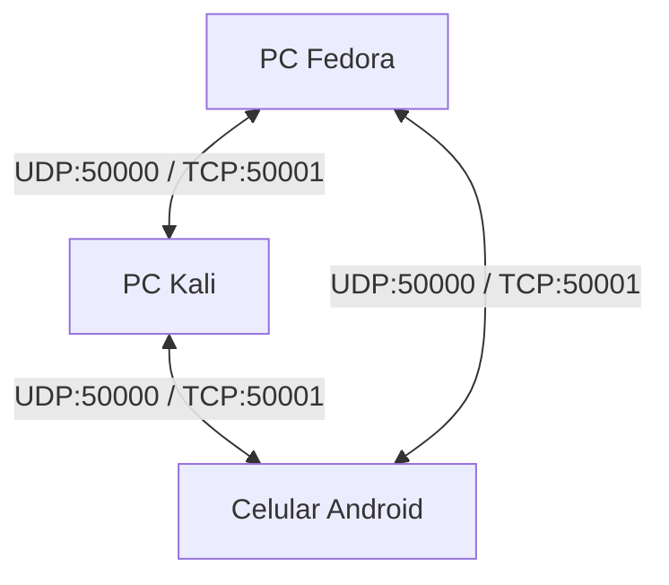

# Arquitectura Mobile Native (P2P Android Node)

A diferencia del paradigma "Gateway Proxy" implementado inicialmente, esta arquitectura eleva al teléfono celular al mismo nivel jerárquico que cualquier otra computadora corriendo SysNode. El celular se convierte en un **Nodo P2P de Primera Clase**.

## 1. Topología P2P Verdadera
En esta arquitectura no existen servidores centrales ni computadoras intermediarias (proxies). El celular Android hablará el **mismo protocolo** de bajo nivel que las computadoras.

## 2. Stack Tecnológico Elegido
* **Framework:** React Native (con Expo CLI para inicialización rápida).
* **UI/UX:** NativeWind (TailwindCSS para React Native) para asegurar un diseño Premium de alto rendimiento.
* **Redes (Sockets Puros):**
  * `react-native-udp`: Para emitir y recibir los *Beacons* de descubrimiento.
  * `react-native-tcp-socket`: Para implementar el protocolo `Length-Prefixed Framing` e intercambiar JSON y binarios (Archivos).
* **Archivos:** `expo-document-picker` y `expo-file-system` para enviar y recibir archivos desde el almacenamiento nativo de Android.

## 3. Implementación del Protocolo Binario (Framing) en JavaScript
Dado que Python utiliza `struct.pack('>I', payload_length)`, en el cliente React Native deberemos replicar esta serialización binaria utilizando `DataView` y `ArrayBuffer`.

**Algoritmo de Envío JS:**
1. Convertir el objeto JSON a String.
2. Convertir el String a `Uint8Array` (UTF-8).
3. Calcular la longitud de bytes `L`.
4. Crear un buffer de `L + 4` bytes.
5. Escribir `L` en los primeros 4 bytes usando `DataView.setUint32(0, L, false) // false = Big-Endian`.
6. Insertar el Payload después de los 4 bytes.
7. Transmitir el buffer crudo vía TCP Socket.

## 4. Limitaciones Controladas
Dado que el celular es ahora un nodo nativo de la red, los usuarios de PC verán al celular en su Radar LAN. 
Sin embargo, el celular **rechazará activamente** cualquier solicitud del tipo `REMOTE_CMD` (Bloqueo de pantalla, etc.) enviando una respuesta estándar de SysNode con `success: False` y `result: "Dispositivo móvil no soporta SysAdmin"`. Esto previene fallos asíncronos en el cliente Python.

## 5. Compilación y Distribución
Para no depender de Android Studio localmente ni ensuciar el entorno, el APK se construirá en la nube utilizando **Expo Application Services (EAS Build)**:
`eas build -p android --profile preview`
Esto generará un archivo `.apk` instalable vía sideload (sin necesidad de Play Store).
